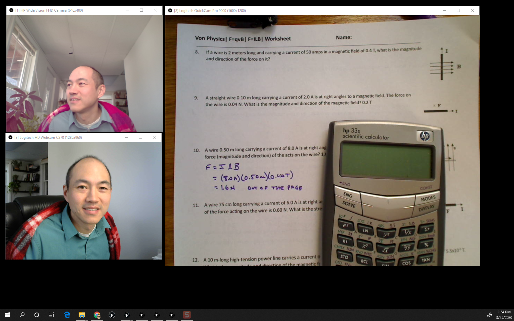

# cameraCapture
Simple camera capture app for showing multiple cameras on the screen. There is no GUI or interface other than keystrokes to change between cameras. The camera names are currently hard-coded for 3 USB cameras. Keypresses '1', '2', and '3' switches between thes three views. Additionally, the [SPACE] key flips / mirrors the image. 

## Dependencies

Requires the video library in Processing.

## Usage:
I wanted a real simple interface that provides a window with the camera view for multiple angles for streaming instructional videos. Logitech has a platform called Capture which allows to switch between different windows and display inputs, but it does not interface with all USB cameras. In fact, it only works with their newest streaming cameras. If you compile and export this application, you can run multiple instances that allow you to show each camera. There is a bit of a lag, but this is a completely workable solution.

